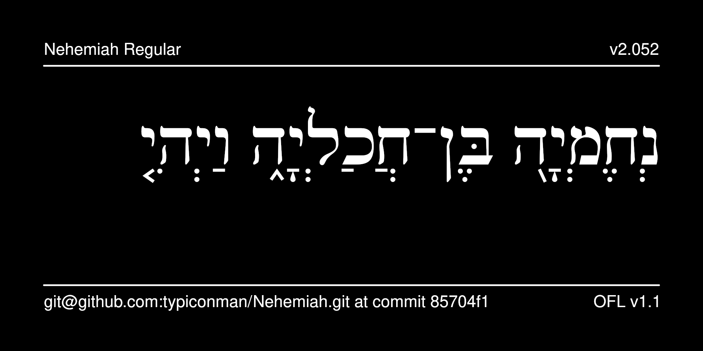

# Nehemiah Typeface

Nehemiah is a typeface fashioned after the square letter forms of the typography of the Biblia Hebraica Stuttgartensia (BHS), a beautiful Old Testament volume familiar to Biblical Hebrew scholars. It is based on [Ezra SIL](https://software.sil.org/ezra/), except that glyphs for the Babylonian vocalization of Hebrew have been added. These glyphs have been proposed for inclusion into Unicode.



## History

Ezra SIL v2.51 is copyright by [SIL International](https://software.sil.org/ezra/). The Babylonian vocalization marks were added by Aleksandr Andreev. Only the Ezra SIL typeface is offered here, there is no SR version.

## License

This Font Software is licensed under the SIL Open Font License,
Version 1.1. This license is available with a FAQ at
[https://openfontlicense.org/](https://openfontlicense.org/).

## Building the Fonts

The font source is stored in a FontForge SFD file in the `sources/` directory. All modifications should be made in FontForge, resulting in an updated SFD file. This file is then converted to UFO format by running the convert script. From terminal:

```
cd your/local/project/directory
./convert.sh
```

The font can then be built using fontmake and gftools by running:

```
make build
```

Note that this requires Python and will install all of the necessary libraries and tools into a virtualenv at `venv/`.

To delete the virtualenv and the results of the build, run:

```
make clean
```

To build the sample image the sits at the top of this README, run:

```
make images
```

The commands `make update` and `make update-project-template` update the repository structure and Python dependencies and should be run periodically.

Google's master repository also had a GitHub workflow for building the fonts in the cloud on push, but this seems to always fail because of incorrect dependencies, so has been disabled. Instead, built binaries are stored on GitHub in the `fonts/` directory.

## More Church Slavonic Fonts

See the [main repository](https://github.com/typiconman/fonts-cu/issues) and the [website](https://sci.ponomar.net/fonts.html).